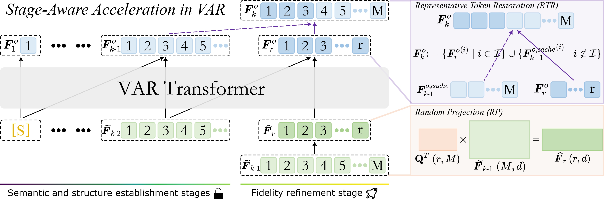
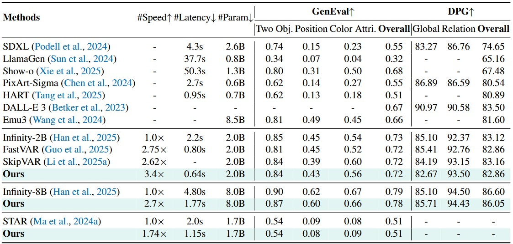

<div align="center">
<h1> 🌟 StageVAR </h1>
<h3>Stage-Aware Acceleration for Visual Autoregressive Models</h3>

[Senmao Li](https://sen-mao.github.io/)<sup>1,3</sup>, [Kai Wang](https://wangkai930418.github.io/)<sup>2</sup>,
[Salman Khan](https://salman-h-khan.github.io/)<sup>3</sup>, [Fahad Shahbaz Khan](https://sites.google.com/view/fahadkhans/home)<sup>3,4</sup>, 
[Jian Yang](https://scholar.google.com/citations?user=6CIDtZQAAAAJ&hl=zh-CN)<sup>1</sup>, [Yaxing Wang](https://yaxingwang.github.io/)<sup>1</sup>,

<sup>1</sup> Nankai University, <sup>2</sup> City University of Hong Kong (Dongguan), China, <sup>3</sup> MBZUAI, <sup>4</sup> Linkoping University
</div>

<p align="center">
    
</p>

<div align="center">
    
    <br>
    <em>Figure 1. Overview of the proposed StageVAR framework. We retain the original VAR inference process for the semantic and structure establishment stages, while exploiting semantic irrelevance and low-rank properties in the fidelity refinement stage to accelerate inference.</em>
</div>


## 🖼️ Qualitative Results

<div align="center">
    
    <br>
    <em>Figure 2. Qualitative comparison with the vanilla Infinity-2B, Infinity-8B, and STAR models (1st, 3rd, and 5th rows). Our StageVAR (2nd, 4th, and 6th rows) achieves a 3.4x, 2.7x, and 1.74x speedup while maintaining performance.</em>
</div>


## 📊 Quantitative Results 

<details>
<summary>Quantitative Results on the GenEval and DPG benchmarks</summary>

<p align="center">
  
</p>
</details>

## 📄 Citation

Please cite our paper if you find this work useful for your research:

```bibtex
@article{li2025stagevar,
  title={StageVAR: Stage-Aware Acceleration for Visual Autoregressive Models},
  author={Li, Senmao and Wang, Kai and Khan, Salman and Khan, Fahad Shahbaz and Yang, Jian and Wang, Yaxing},
  journal={arXiv preprint arXiv:2512.16483},
  year={2025}
}
```

:star: If StageVAR is helpful to your projects, please help star this repo. Thanks! :hugs:
